

<!-- ctrl-tower profile — every panel is a hand-tuned animated SVG (renders natively on GitHub).
     motion/video versions renderable from ./remotion -->


<a href="https://prashantbasnet.com"></a>

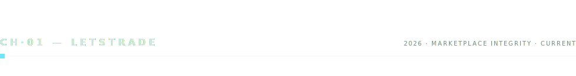


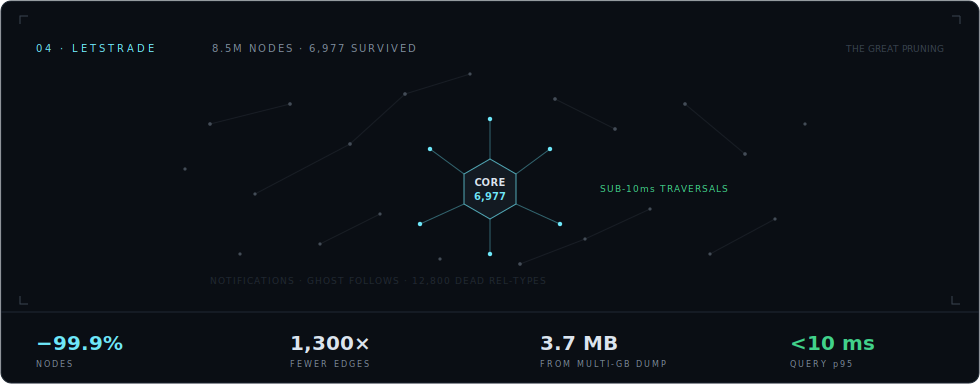

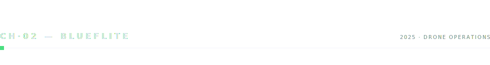

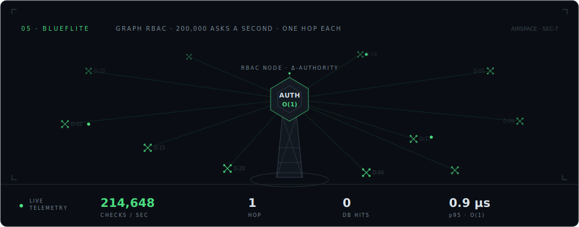

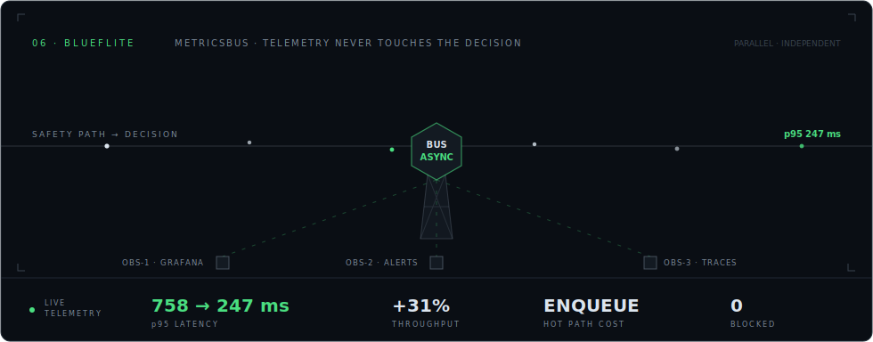

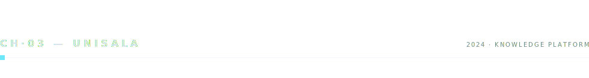

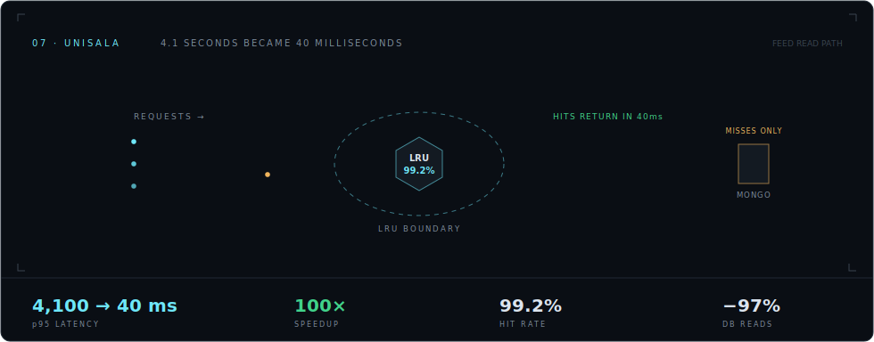

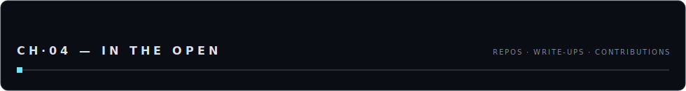

<a href="https://github.com/prashantbasnet94?tab=repositories"></a>

[`authz-engine`](https://github.com/prashantbasnet94/authz-engine) · [`event-bus`](https://github.com/prashantbasnet94/event-bus) · [`top-k-youtube-videos`](https://github.com/prashantbasnet94/top-k-youtube-videos) · [`nodejs-performance-benchmark`](https://github.com/prashantbasnet94/nodejs-performance-benchmark)

<a href="https://unisala.com/signature/64dd5983d1aa61cf8887f9fa"></a>

<picture>
  <source media="(prefers-color-scheme: dark)" srcset="https://raw.githubusercontent.com/prashantbasnet94/prashantbasnet94/output/github-contribution-grid-snake-dark.svg" />
  <source media="(prefers-color-scheme: light)" srcset="https://raw.githubusercontent.com/prashantbasnet94/prashantbasnet94/output/github-contribution-grid-snake.svg" />
  
</picture>

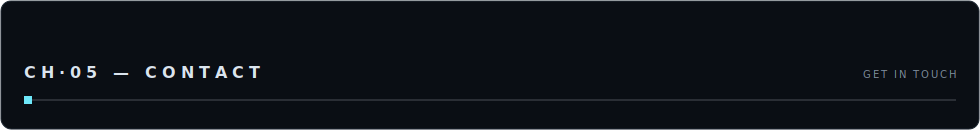

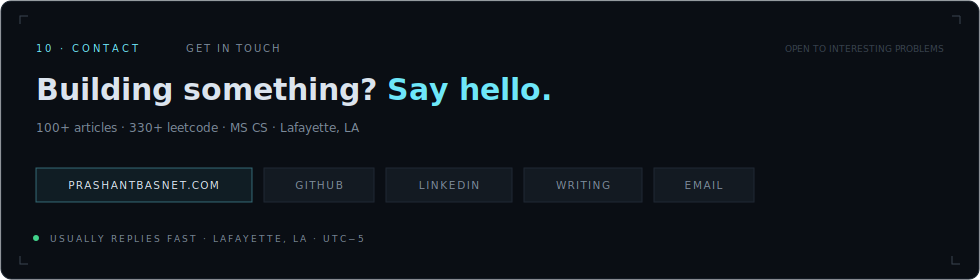

[`prashantbasnet.com`](https://prashantbasnet.com) · [`github`](https://github.com/prashantbasnet94) · [`linkedin`](https://www.linkedin.com/in/prashantbasnet94/) · [`writing`](https://unisala.com/signature/64dd5983d1aa61cf8887f9fa) · [`leetcode`](https://leetcode.com/u/prashantbasnet94/) · [`email`](mailto:prashantbasnet94@gmail.com)

